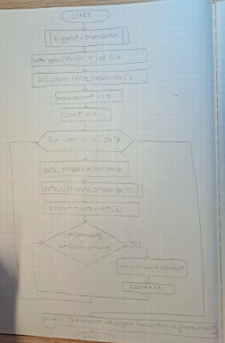
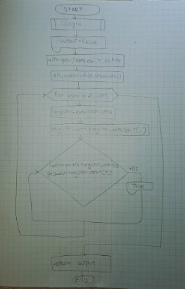
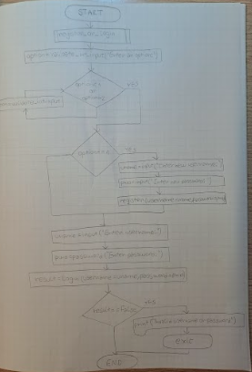

# Unit 1 project - Crypto Wallet
  
<sub>Litecoin by Team Luno</sub>
# Criterion A: Planning

## Problem definition

Ms. Sato is a local trader who is interested in the emerging market of cryptocurrencies. She has started to buy and sell electronic currencies, however at the moment she is tracking all her transaction using a ledger in a spreadsheet which is starting to become burdensome and too disorganized. It is also difficult for Ms Sato to find past transactions or important statistics about the currency. Ms Sato is in need of a digital ledger that helps her track the amount of the cryptocurrency, the transactions, along with useful statistics. 

Apart for this requirements, Ms Sato is open to explore a cryptocurrency selected by the developer.

An example of the data stored is 

| Date | Description | Category | Amount  |
|------|-------------|----------|---------|
| Sep 23 2022 | bought a house | Expenses | 10 BTC |
| Sep 24 2022 | food for house celebration | Food | 0.000001 BTC |

## Proposed Solution

Design statement:
I will to design and make a digital ledger for a client who is local trader. The digital ledger will be about keeping track of cryptocurrency transactions and is constructed using the software Python. It will take one week to make and will be evaluated according to the criteria listed bellow.

### Justifying the softwer selected
I will be using python because it is easy to learn and use, codes can be easily written and executed much faster than other programming languages. Furthermore, Python is one of the most user-friendly programming languages since it has a simple syntax and is not overly complex, putting more of an emphasis on natural language.

### Justifying the structure of the proposal solution
I'll create a Python project in Pycharm using a Project 1 python file to implement the digital ledger. Several functions that have already been defined in My library Python file will be called by this file. Programming is made simpler to manage and adjust when various functions are written individually. As a result, code will be simpler to read and more approachable.

## What is LiteCoin?

Litecoin is a cryptocurrency founded in 2011, two years after Bitcoin, by a former Google engineer named Charlie Lee.
It shares similar features with Bitcoin but has a different algorithm. The cryptocurrency's goal is to become a medium for daily transactions.
Litecoin has a faster transaction processing time compared to Bitcoin.

McFarlane, G. (2022, April 14). What is Litecoin (LTC)? Investopedia. Retrieved September 29, 2022, from https://www.investopedia.com/articles/investing/040515/what-litecoin-and-how-does-it-work.asp 

## Success Criteria
1. The electronic ledger is a text-based software (Runs in the Terminal).
2. The electronic ledger display the basic description of the cyrptocurrency selected.
3. The electronic ledger allows to enter, withdraw and record transactions.
4. The electronic ledger allows user to enter just if the password is corect. 
5. The electronic ledger display the biggest transaction.
6. The electronic ledger show 5 latest transactions entered.
# Criterion B: Design
## System diagram


Fig 1. System diagram of this program

## Flow diagrams


Fig 2. Flow diagram of the biggest transaction function.



Fig 3. Flow diagram of the login function.



Fig 4. Flow diagram of the register or login function.

## Test plan
| No. | Test type      | Tested function      | Test steps                                                                                                                                       | Expected result                                                                                                                                                                                                                                                                                                                                            |
|-----|----------------|----------------------|--------------------------------------------------------------------------------------------------------------------------------------------------|------------------------------------------------------------------------------------------------------------------------------------------------------------------------------------------------------------------------------------------------------------------------------------------------------------------------------------------------------------|
| 1   | Functional     | validate_int_input           | 1. Use validate_int_input function. 2. Input a string. 3. Input a digit.                    | 1. With a string, error message will be displayed. 2. With a digit program continues.                                                                                                                                                                                                                                                                           |
| 2   | Functional     | register()              | 1. Use register function. 2. Input username and password.                      | 1. Userame and password are stored in database file. 2. Succes message will appear.|
| 3   | Functional     | login | 1. Use login function. 2. Input different username/password than written in register function. 3. Input same username and password as written in register function.                                                                                        | 1. With a wrong username/password error message will be displayed and program will be closed. 2. With a correct username and password program conitues and succes message will be displayed.                                                                                                                                                                                                                                          |
| 4   | Functional | transactions()|   1. Use transactions function. 2. Choose between option 1(deposit) and 2(withdrawal). 3. Input date, category, description and amount.| 1. User will be able to enter transaction. 2. Information will be stored in database file.
| 5   | Non-functional | instructions       |  1. Run program.  2. Check whether are messages clear and easy to understand and directions easy to follow.                                            | Directions are easy to follow  and messages are clear and easy to understand..                                                                                                                                                                                                                                  |
| 6   | Non-functional | error  | 1. Input wrong outcomes as options. 2. Check whether are error messages explicit and understandable.                 | Error messages are simple and easy to understand.                                         |
## Record of Tasks
| Task No | Planned Action                                                | Planned Outcome                                                                                                 | Time estimate | Target completion date | Criterion |
|---------|---------------------------------------------------------------|-----------------------------------------------------------------------------------------------------------------|---------------|------------------------|-----------|
| 1       | Create system diagram                                         | To have a clear idea of the hardware and software requirements for the proposed solution.                        | 10min         | Sep 24                 | B         |
| 2       | Meet with the client                                        | Discuss the issues that the client is experiencing and develop a plan to assist the client in resolving the issues.                      | 20min         | Sep 24                 | A         |
| 3      | Write a problem solution for the client                                       | An explanation that makes sence for the client and developer.| 15min         | Sep 24                 | A         |
| 4      | Write success criterias                                       | A clear success criteria that suits the client and developer. | 10min         | Sep 24                 | A         |
| 5      | Create a registration and login system                                       | To develop a program that allows the client to register and login setting up a username and password. | 45min         | Sep 25                 | C         |
| 6      | Code main menu| To allow client choosing between different options from the menu and interacting with the program.| 30min         | Sep 26                 | C         |
| 7      | Code a menu for transactions| Code menu that allows client to choose between 2 options: deposit or withdrawal. | 30min         | Sep 27                 | C         |
| 8      | Code function that allows client to see the biggest transaction| Create a code that allows client to see an amount of the biggest transaction made. | 50min         | Sep 29                 | C         |
| 9      | Code function that allows client to see last 5 transactions| Create a code that allows client to see 5 latest transactions entered. | 15min         | Sep 30                 | C         |
| 10      | Validate client's input for all option choices| Create a code that that would make sure that client's inputs follow certin requirements. | 1hr        | Oct 1                 | C         |
| 11      | Draw flow diagrams| Draw flow diagrams to have clear idea of functions' structure. | 1hr        | Oct 3                 | B        |
| 12      | Meet with the client| Have a feedback about the program's present state. | 20min        | Oct 7                 | B         |
| 13      | Final fix| Final changes based on the customer's feedback. | 2hrs        | Oct 9                 | C         |

# Criterion C: Development
## Techniques used:
1. Functions
2. For/While loops
3. Input validation
4. If statements
## Code

## Register and login system
```.py
# register or login
def register_or_login():
    option = validate_int_input(" Enter an option: ")
    while option < 1 or option > 2:
        option = validate_int_input(f"{cs_red} Invalid option. Please enter an option [1-2]: {end_code}")
    if option == 1:
        uname = input(" Enter new username: ")
        pwd = input(" Enter new password: ")
        register(username=uname, password=pwd)
    uname = input(" Enter username: ")
    pwd = input(" Enter password: ")
    result = login(username=uname, password=pwd)
    if result == False:
        print(f"{cs_red} You have entered an invalid username or password.{end_code}")
        exit()

# register
def register(username: str, password: str):
    with open("users.csv", "w") as file:
        file.write(f"{username},{password} \n")
        registered = "Well done! You are registered. Now you can login."
        print(cs_green, registered, end_code)

# login
def login(username: str, password: str) -> bool:
    output = False
    with open("users.csv", "r") as file:
        all_users=file.readlines()
        for user in all_users:
            register_data = user.strip()
            register_data1 = register_data.split(",")
            if username == register_data1[0] and password == register_data1[1]:
                output = True
    return output
```
Making a registration system so that a client can open a Crypto Wallet is the first step in generating a digital ledger for that client. The client is given the option of logging in or registering (if that is the first time that he is entering the ledger), and in order to enter a digital ledger those two should match, othervise program is closing. That will provide protection of private data of my client.

## Main menu

```.py
login_msg = "Well done! You are logged in! Let's start."
prompt_msg1 = "Please enter an option [1-4]"
content1 = "OPTIONS"
menu1 = '''
    1. Basic description of cryptocurrency
    2. Create a transaction
    3. Show biggest transaction
    4. Show 5 last transactions
    '''
enter_option = " Enter your option: "
print(cs_green, login_msg, end_code)
print(content1.center(50))
print(menu1)
print(cs_cyan, prompt_msg1, end_code)
option1 = validate_int_input(enter_option)
while option1 < 1 or option1 > 4:
    option1 = validate_int_input(f"{cs_red} Invalid option. Please enter an option [1-4]: {end_code}")
```
In order to allow my client to interact with the digital ledger I created main manu, which allows client to choose between different options.
Every option entered by user will need to follow certain requirements and will be validated. (Eg. option has to be a digit and to be in a certain range of numbers)

 ## Biggest transaction
 ```.py
 def biggest_transaction():
    with open('db.csv', 'r') as file:
        all_data = file.readlines()
        max_amount = -1
        count = 0
        for user in all_data:
            data_stripped = user.strip()
            data_list = data_stripped.split(",")
            #date = data_list[0]
            #description = data_list[1]
            #category = data_list[2]
            amount = data_list[3]
            if int(amount) > int(max_amount):
                max_amount = amount
            count +=1
            
    print(f" The amount of the biggest transaction is {max_amount}.")
 ```
This function will give my client an information about the amount of the biggest transaction made by reading db.csv file and comparing data in items of a list with index [3].
# The last 5 transactions
```.py
def recent_transactions():
    with(open('db.csv', "r")) as f:
        data = list(csv.reader(f))
        print(data[-5:])
 ```
This function will provide my client an information of the five latest transactions entered by opening db.csv file and reversing items of te list.
       
## Video of the program
[Video of the program](video.mov)


