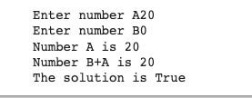

# quiz 002

## Python Code
``` .py
#given 2 numbers, A and B, Output TRUE if one of them is 20 or if their sum is 20
number_A = int(input("Enter number A"))
number_B = int(input("Enter number B"))
output = False

if number_A == 20:
  print("Number A is 20")
  output = True
if number_B == 20:
   print ("Number B is 20")
   output = True
if number_B + number_A == 20:
  print ("Number B+A is 20")
  output = True

if number_A == 20 or number_B == 20 or number_B + number_A == 20:
  output = True

print (f"The solution is {output}")
```
##

## Results

