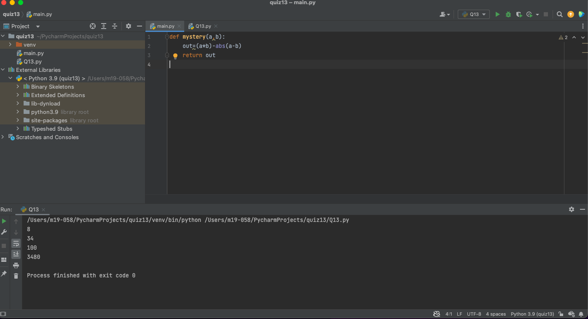
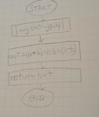

# Quiz 13: Create a function that receives one input and produces the output shown. 
## Code
### Main.py file
```.py
def mystery(a,b):
    out=(a*b)-abs(a-b)
    return out
```
### My_library.py file
```.py
from main import mystery
out1 = mystery(2,6)
print(out1)
out2 = mystery(4,10)
print(out2)
out3 = mystery(10,10)
print(out3)
out4 = mystery(70,50)
print(out4)
```
## Test

## Flow chart

