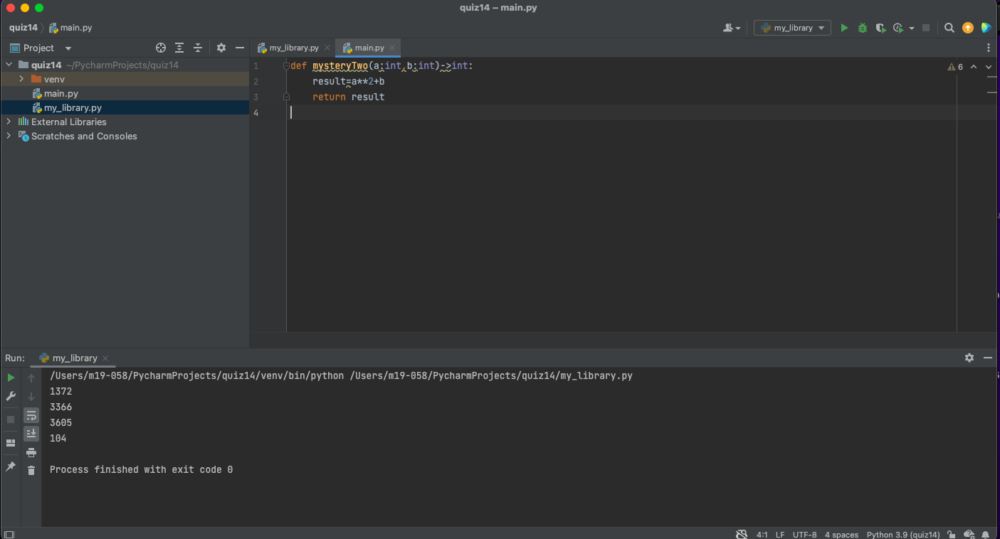
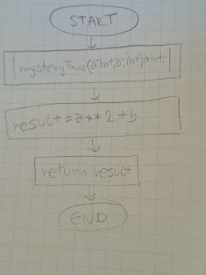

# Quiz 14: Create a function that receives one input and produces the output shown. 
## Code
### Main.py file
```.py
def mysteryTwo(a:int,b:int)->int:
    result=a**2+b
    return result
```
### My_library.py file
```.py
from main import mysteryTwo
out1=mysteryTwo(37,3)
print(out1)

out2=mysteryTwo(58,2)
print(out2)

out3=mysteryTwo(60,5)
print(out3)

out4=mysteryTwo(10,4)
print(out4)
```
## Test


## Flow chart

