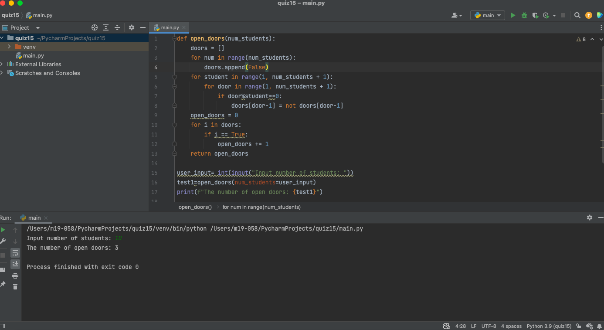

# Quiz 15
## Code
```.py
def open_doors(num_students):
    doors = []
    for num in range(num_students):
        doors.append(False)
    for student in range(1, num_students + 1):
        for door in range(1, num_students + 1):
            if door%student==0:
                doors[door-1] = not doors[door-1]
    open_doors = 0
    for i in doors:
        if i == True:
            open_doors += 1
    return open_doors

user_input= int(input("Input number of students: "))
test1=open_doors(num_students=user_input)
print(f"The number of open doors: {test1}")
```
## Test

