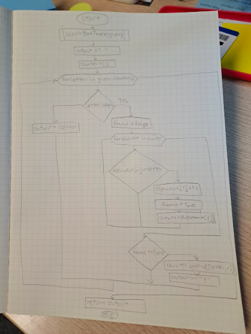

# Quiz 16
## Code
```.py
def blackboxThree(given:str)->str:
    output = ""
    counter = []
    for letter in given.lower():
        if letter.isalpha():
            found = False
            for element in counter:
                if element[0] == letter:
                    element[1] += 1
                    found = True
                    output += str(element[1])
            if found == False: #new letter
                counter.append([letter, 1])
                output += "1"
        else:
            output += letter
    return output

test1 = blackboxThree("hello world")
test2 = blackboxThree("aaaaAABB")
test3 = blackboxThree("abABabAB")
test4 = blackboxThree("Create a Function")
print(test1, test2, test3, test4, sep="\n")
```
## Test

