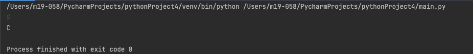

# Quiz 3

## DNA

## Float diagram

## Python code

```.py
in_protein = str(input())
if in_protein == "A":
    print("T")
if in_protein == "G":
    print("C")
if in_protein == "T":
    print("A")
if in_protein == "C":
    print("G")
```

## Test

