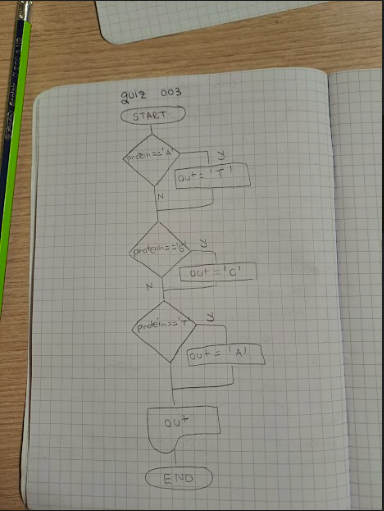
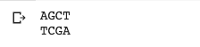

# Quiz 3

## Float diagram



## DNA

## Python code

```.py
in_protein= input()
out_protein=""

for i in in_protein.upper():
    if i=="A":
        out_protein=out_protein+"T"
    if i=="G":
        out_protein=out_protein+"C"
    if i=="T":
        out_protein=out_protein+"A"
    if i=="C":
        out_protein=out_protein+"G"

print(out_protein)
```

## Result

