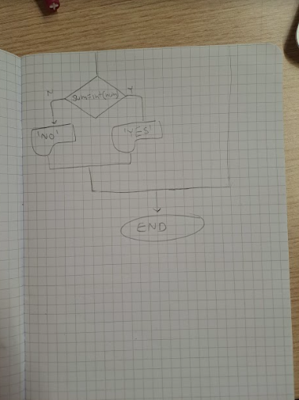

# Quiz 4

## Flow diagram




## Python code

```.py
num= input('Please input a integer: ')
max_number_tries=5
while num.isdigit()==False and max_number_tries>0:
    num= input('error! please input a 2 digit integer')
    max_number_tries= max_number_tries+1

if max_number_tries!=0:
    print('well done entering an integer')
    sum=0
    for n in num:
        sum=sum+int(n)
    if sum==int(num):
        print("Perfect Number")
    else:
        print("Not Perfect Number")
else:
    print("you ran out of chances to enter an integer")
    exit()
 ```
## Test


