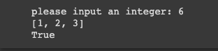

# Quiz 5

# Factors

## Float diagram

## Python code
```.py
num= input("please input an integer: ")
while not num.isdigit():
    num = input("please input an INTEGER")
num=int(num)
factors=[1]
factor=2

sum=1
while factor<=num/2:
    if num%factor==0:
        factors.append(factor)
        sum=sum+factor
    factor+=1
print(factors)
print(sum==num)
```

## Test


