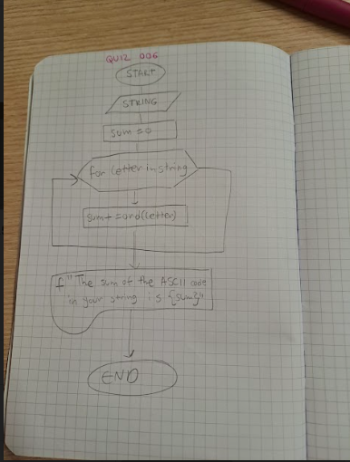
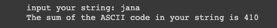

# Quiz 6

# Add letters

## Float diagram


## Python code
```.py
string=input('input your string: ')
sum=0
for letter in string:
    sum+=ord(letter)
print(f'The sum of the ASCII code in your string is {sum}')
```
## Test

