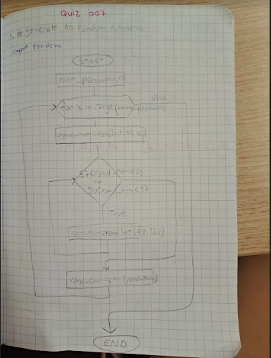

# Quiz 7

## Float diagram



## Python code

```.py
import random
password=[]
num_digits= int(input("Please input the digits you want your password to be: "))
if_symbols=input('Please type True if you would like to have digits in your password: ')

if if_symbols.title()=="True":
    for x in range(num_digits):
        digit = random.randint(48, 122)
        while 57 < digit < 65 or 90 < digit < 97:
            digit = random.randint(48, 122)
        rand_chr = chr(digit)
        password.append(rand_chr)
if if_symbols.title()!="True":
    for x in range(num_digits):
        digit = random.randint(65, 122)
        while 90 < digit < 97:
            digit = chr(random.randint(65, 122))
        rand_chr=chr(digit)
        password.append(rand_chr)
for element in password:
    print(element, end=" ")

```

# Test


