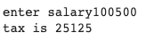

# salary range

## Python Code
```.py
salary_range = int(input("enter salary"))
if salary_range < 10011:
  output = int(salary_range * 0.05)
if salary_range >=10001 and salary_range <500001:
    output = int(salary_range * 0.10)  
if salary_range >=50001 and salary_range <100001:
      output = int(salary_range * 0.15)     
if salary_range >=100001:
            output = int(salary_range * 0.25)           
print(f"tax is {output}")
```
##

## Results

