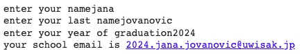

# school email

## Python Code
``` .py
name = input("enter your name")
lastname = input("enter your last name")
year_of_graduation = input("enter your year of graduation")
output = f"{year_of_graduation}.{name}.{lastname}@uwisak.jp"
print(f"your school email is {output}")
```

## Results

