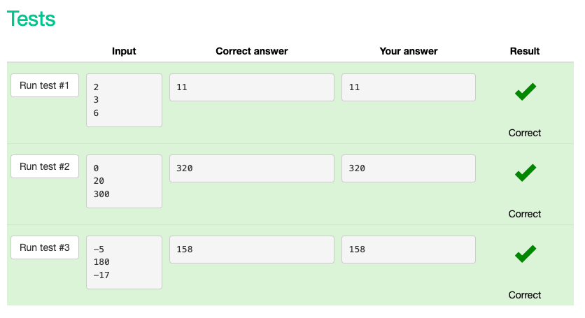

# snakify 

## Unit 1: Input, print and numbers 

### Sum of three numbers

#### code

```.py
# This program reads three numbers and prints their sum:
a = int(input())
b = int(input())
c = int(input())
print(a + b + c)
```

#### test results


### Hi John

#### code

```.py
name=input()
print('Hi ' + name)
```

#### test results

