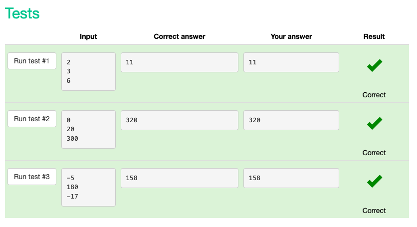
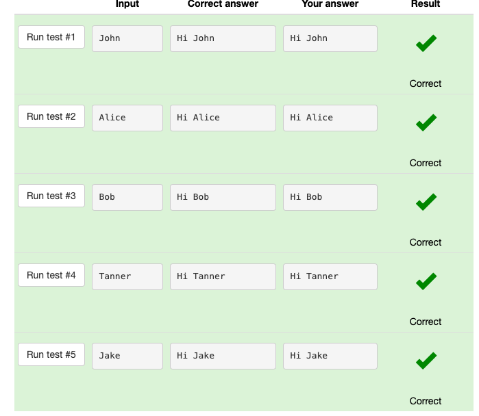
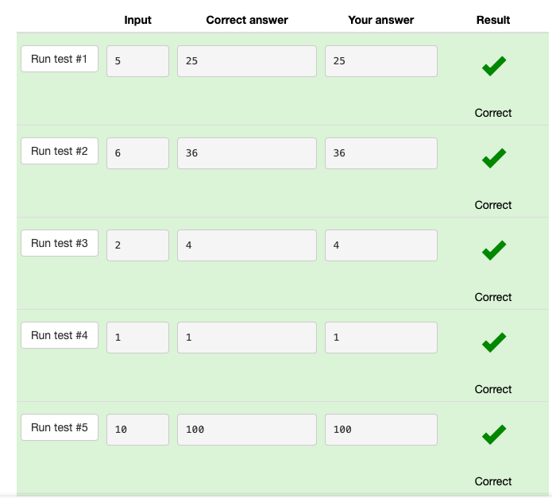
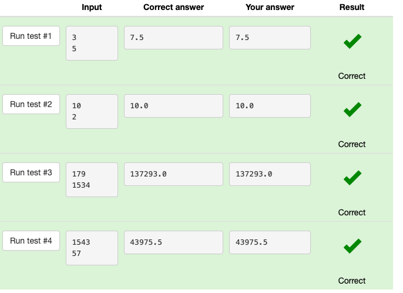
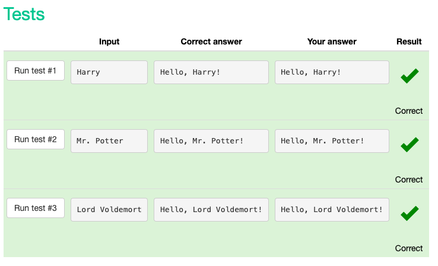
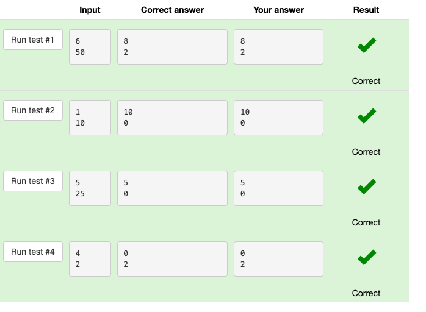
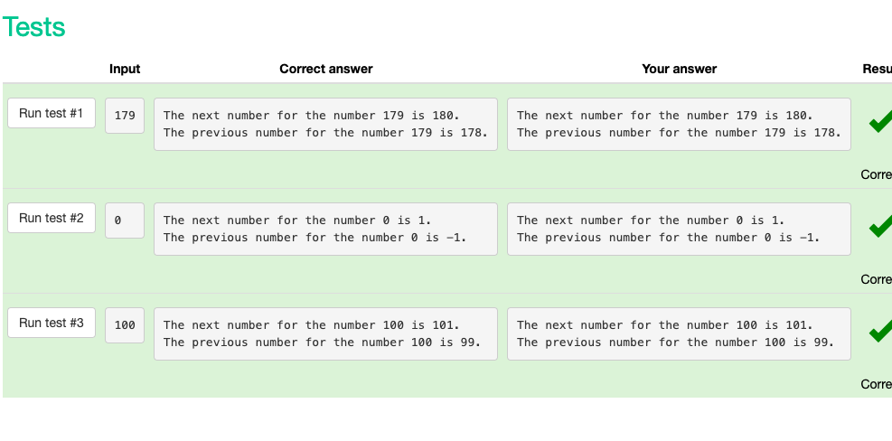
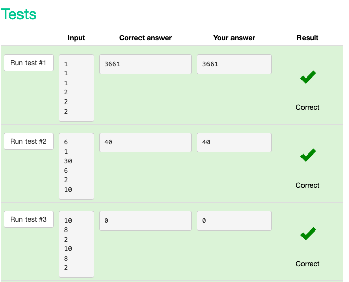
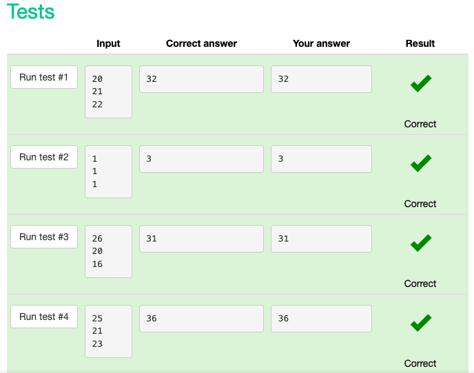

# Snakify UNIT 1 

## Input, print and numbers 

### Sum of three numbers

#### code

```.py
# This program reads three numbers and prints their sum:
a = int(input())
b = int(input())
c = int(input())
print(a + b + c)
```

#### test results


### Hi John

#### code

```.py
name=input()
print('Hi ' + name)
```

#### test results


### Square

#### code

```.py
number=int(input())
square=number**2
print(square)
```

#### test results


### Area of right-angled triangle

#### code

```.py
b=int(input())
h=int(input())
area=((b*h)/2)
print(area)
```

#### test results


### Hello, Harry!

#### code

```.py
name = input()
print('Hello, ' + name + '!')
```

#### test results


### Apple sharing

#### code

```.py
n = int(input())
k = int(input())
e = k//n
r = k%n
print(e)
print(r)
```

#### test results


### Previous and next

#### code

```.py
number = int(input())
print("The next number for the number " + str(number) + " is " + str(number+1) + ".")
print("The previous number for the number " + str(number) + " is " + str(number-1) + ".")
```

#### test results


### Two timestamps

```.py
hours=int(input())
minutes=int(input())
seconds=int(input())
hours2=int(input())
minutes2=int(input())
seconds2=int(input())
hoursu = (hours2 * 3600) - (hours*3600)
minutesu = (minutes2 * 60) - (minutes * 60)
secondsu = (seconds2) - (seconds)
s = hoursu + minutesu + secondsu
print(s)
```

#### test results


### School desks

```.py
a = int(input())
b = int(input())
c = int(input())
print(a//2 + b//2 + c//2 + a%2 + b%2 + c%2)
```

#### test results

