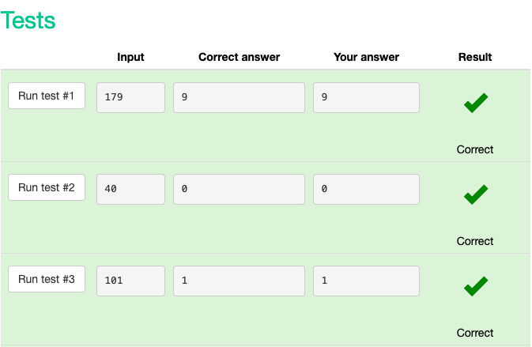
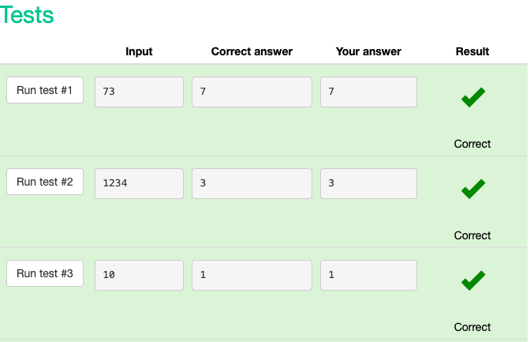
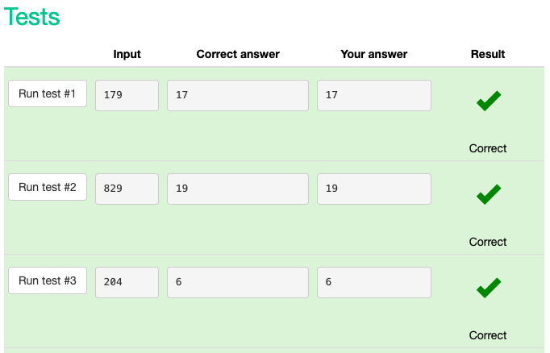
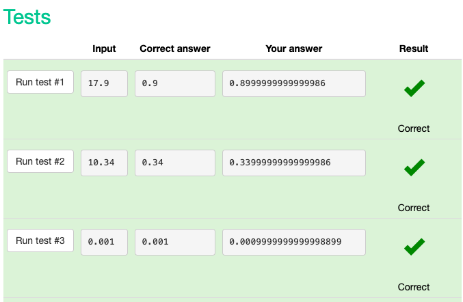
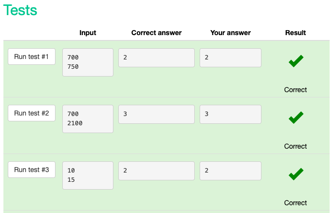

# Snakify UNIT 2

## Integer and float numbers

### Last digit of integer

#### code

```.py
number = int(input())
last_digit = number % 10
print (last_digit)
```

#### test results



### Two digits

#### code

```.py
number = int(input())
a= number%10
b=number//10%10
print(str(b) + " " + str(a))
```

#### test results

### Swap digits

#### code

```.py
number = int(input())
a = number%10
b = number//10
print(str(a) + str(b))
```
#### test results

### last two digits

#### code

```.py
a=int(input())
x=a%100
print(x)
```
#### Tens digit

### Tens digit

#### code

```.py
number = int(input())
tens_digit = (number//10%10)
print(tens_digit)
```

#### test results



### sum of digits

#### code

```.py
number = int(input())
last_digit = number % 10
second_digit = number // 10 % 10
third_digit = number // 100
sum = (last_digit + second_digit + third_digit)
print(sum)
```
#### test results



### fractional part

#### code

```.py
number = float(input())
print(number%1)
```
#### test results



### car route

#### code

```.py
from math import ceil
n = int(input())
m = int(input())
days = ceil (m/n)
print (days)
```
#### test results


