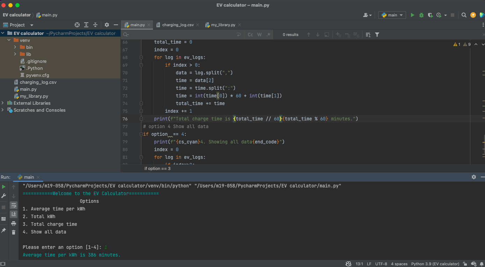
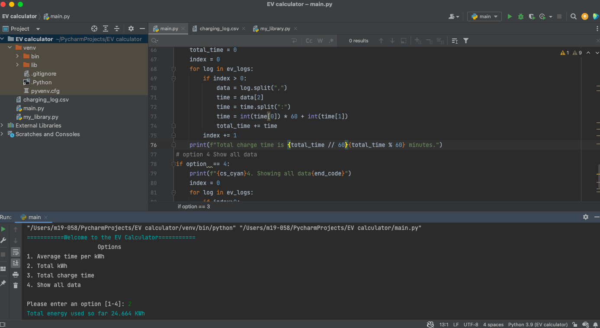
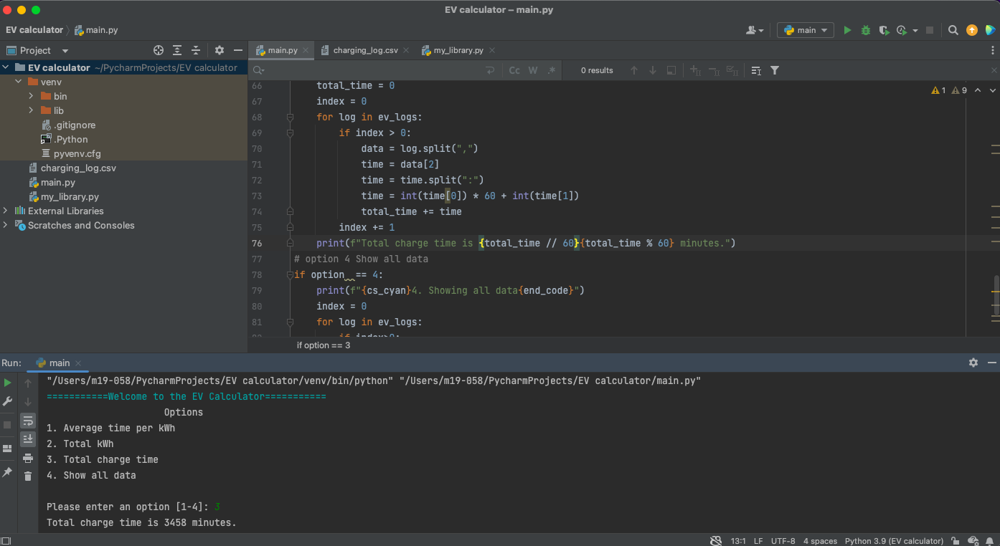
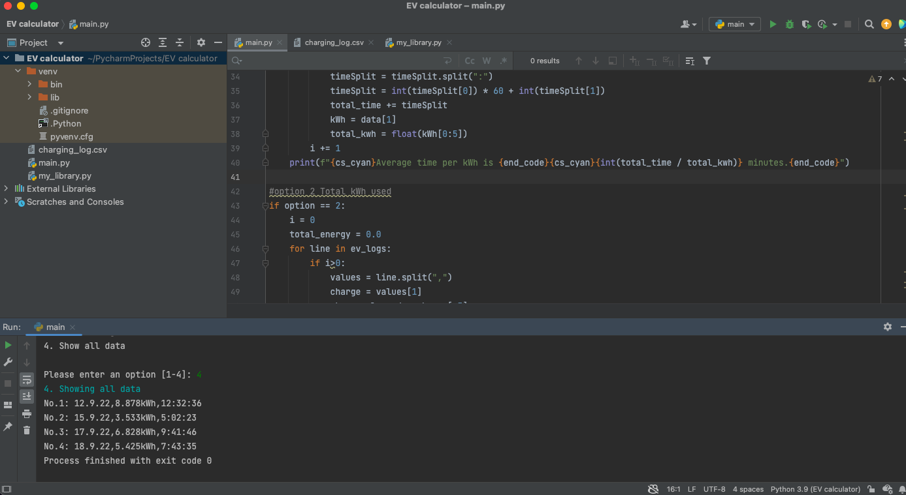

# EV calculator
## Code

## Main
```.py
# EV_calculator
from my_library import *

# welcome
welcome_msg = "Welcome to the EV Calculator".center(50, "=")
prompt_msg = "Please enter an option [1-4]: "

print(f"{cs_cyan}{welcome_msg}{end_code}")
print("Options".center(50))

menu = """1. Average time per kWh
2. Total kWh
3. Total charge time
4. Show all data
"""
print(menu)
option = validate_int_input(prompt_msg)
while option>4 or option < 1:
    option = validate_int_input(f"{cs_red}Invalid option. {prompt_msg}{end_code}")

#show all data
with open("charging_log.csv", "r") as file:
    ev_logs = file.readlines()

# option 1 Average time per kWh
if option == 1:
    total_time = 0
    total_kwh = 0
    i = 0
    for line in ev_logs:
        if i > 0:
            data = line.split(",")
            timeSplit = data[2]
            timeSplit = timeSplit.split(":")
            timeSplit = int(timeSplit[0]) * 60 + int(timeSplit[1])
            total_time += timeSplit
            kWh = data[1]
            total_kwh = float(kWh[0:5])
        i += 1
    print(f"{cs_cyan}Average time per kWh is {end_code}{cs_cyan}{int(total_time / total_kwh)} minutes.{end_code}")

#option 2 Total kWh used
if option == 2:
    i = 0
    total_energy = 0.0
    for line in ev_logs:
        if i>0:
            values = line.split(",")
            charge = values[1]
            charge_cleaned = charge[:5]
            charge_float = float(charge_cleaned)
            total_energy += charge_float
        i += 1

    print(f"{cs_cyan}Total energy used so far {total_energy} KWh {end_code}")

# option 3 Total charge time
if option == 3:
    total_time = 0
    index = 0
    for log in ev_logs:
        if index > 0:
            data = log.split(",")
            time = data[2]
            time = time.split(":")
            time = int(time[0]) * 60 + int(time[1])
            total_time += time
        index += 1
    print(f"Total charge time is {total_time // 60}{total_time % 60} minutes.")
# option 4 Show all data
if option  == 4:
    print(f"{cs_cyan}4. Showing all data{end_code}")
    index = 0
    for log in ev_logs:
        if index>0:
            print(f"No.{index}: {log}", end="")
        index += 1
```
## my library

```.py
def validate_int_input(msg:str)->int:
    number=input(msg)
    while not number.isdigit():
        number = input( f'error, {msg}')
    return int(number)

cs_red = "\33[0;31m"
cs_green = "\33[0;32m"
cs_cyan = "\33[0;36m"
end_code = "\033[00m"
```
## csv file
```
date,charge,duration
12.9.22,8.878kWh,12:32:36
15.9.22,3.533kWh,5:02:23
17.9.22,6.828kWh,9:41:46
18.9.22,5.425kWh,7:43:35
```

## Test







